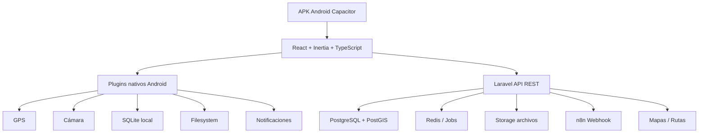

# Arquitectura general del sistema

Guaranda Go es una app híbrida Android con backend Laravel y frontend React/Inertia empaquetado con Capacitor.

## Principios

- Un solo proyecto Laravel en `ciclismo-guaranda/`.
- Backend modular por dominios.
- API REST para funciones móviles y sincronización.
- Inertia para vistas internas/web cuando aplique.
- Capacitor para empaquetar Android y acceder a APIs nativas.
- SQLite local para offline.
- PostGIS para geodatos.

## Módulos principales

- Usuarios y autenticación.
- Rutas.
- POIs.
- Incidencias.
- Recorridos GPS.
- Favoritos.
- Valoraciones/comentarios.
- Offline/sincronización.
- Chatbot n8n.
- Administración/estadísticas.
