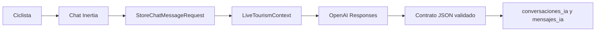

# Dominio: Asistente cicloturístico

## Estado actual

El asistente es una frontera Laravel/OpenAI. No usa n8n ni endpoints de tools.
`Cyclist\ChatController` valida la consulta, construye el contexto público vivo,
llama a `OpenAiAssistant` y guarda el intercambio solo después de recibir una
respuesta válida.



## Contexto y límites

- Solo incluye rutas con estado `Activa`, POIs con `active=true` e incidencias
  visibles `En revisión`.
- La ruta elegida lleva su detalle, recomendaciones, observaciones, POIs y
  alertas; además se incluyen resultados públicos acotados relevantes para la
  consulta.
- La ubicación opcional se usa durante la llamada y no se guarda en
  `conversaciones_ia` ni `mensajes_ia`.
- La conversación se limita a los últimos ocho mensajes, con texto truncado.
- El modelo no puede crear enlaces, tarjetas, IDs ni datos: responde `reply` y
  hasta tres `suggested_actions`. Laravel y la UI son dueños de cualquier
  navegación futura.
- El asistente diferencia una visita de día de una estadía turística cuando la
  respuesta depende de ello: visitante = paso por el día; turista = pernocta.
  Nunca se persiste como rol del usuario.

## Cuatro momentos para orientar

1. Cómo llegar y preparar el desplazamiento.
2. Dónde comer.
3. Qué hacer y visitar.
4. Dónde dormir.

Si el contexto no contiene un dato, el asistente debe decirlo y evitar
inventarlo. Alertas y seguridad tienen prioridad sobre una recomendación.

## Persistencia

`conversaciones_ia` conserva el propietario, título, contexto público sin
ubicación, inicio, última actividad y soft delete. `mensajes_ia` conserva el
rol, texto, proveedor `openai`, metadatos mínimos (`model`, sugerencias y
tarjetas de recursos ya verificadas por Laravel) y fecha. La creación/
actualización de conversación y ambos mensajes es atómica. OpenAI solo puede
proponer `{kind, id}` de una ruta o POI recibido en el contexto; Laravel vuelve
a consultar su estado actual antes de persistirlo o renderizarlo.

## Configuración

Laravel solo lee configuración mediante `config('guaranda.assistant.openai.*')`:

```dotenv
OPENAI_API_KEY=
GUARANDA_GO_OPENAI_MODEL=
GUARANDA_GO_OPENAI_TIMEOUT_SECONDS=20
GUARANDA_GO_OPENAI_CONNECT_TIMEOUT_SECONDS=3
GUARANDA_GO_OPENAI_MAX_OUTPUT_TOKENS=700
GUARANDA_GO_OPENAI_VISION_MODEL=
GUARANDA_GO_OPENAI_VISION_MAX_IMAGE_BYTES=5242880
```

La clave y el modelo se definen como secretos en Dokploy. Si faltan, el chat no
envía solicitudes y muestra un error seguro. Se usa `store: false`; no se
envían secretos, nombres, emails, roles ni cabeceras al proveedor.

Para iniciar se puede usar `gpt-4o-mini` tanto en
`GUARANDA_GO_OPENAI_MODEL` como en `GUARANDA_GO_OPENAI_VISION_MODEL`: admite
texto e imagen de entrada, Structured Outputs y el endpoint Responses. Esto no
configura embeddings; `text-embedding-3-large` queda reservado para la Etapa 3
cuando el preflight de pgvector sea correcto.

Para descripciones de imágenes editoriales administradas se añade
`GUARANDA_GO_OPENAI_VISION_MODEL`; sin ese secreto no se encola nada. El job
acepta solamente JPEG, PNG o WebP de hasta 5 MB desde el disco público
gestionado, usa `store: false`, un detalle de visión bajo y un único intento.
Conserva una descripción humana ya presente y nunca procesa archivos de
incidencias de ciclistas.

## Evolución vectorial e imágenes

La Fase 17 deja preparada la transición a pgvector con
`text-embedding-3-large` y descripciones automáticas de imágenes admin. No se
crea ni modifica todavía ninguna tabla vectorial hasta reparar el runtime de
PostGIS y planificar una ventana de mantenimiento. Plan: `17_agente_laravel_openai.md`.

El preflight no destructivo `php artisan ai:vector-preflight` consulta la base
actual y falla de forma segura si `vector` no está disponible o no carga en
runtime. No se autoriza una migración de embeddings hasta que el preflight sea
correcto en la base elegida.
