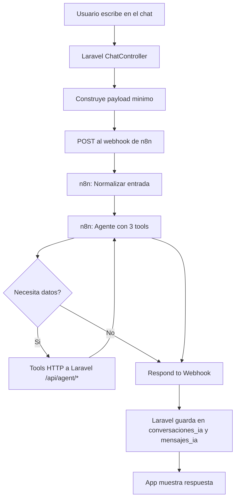

# Dominio: Chatbot IA / Asistente cicloturístico

## Visión general

Guaranda Go no implementa IA nativa. El asistente vive en un agente externo de n8n. Laravel es el intermediario: recibe el mensaje, lo envía al webhook, recibe la respuesta y guarda el historial.



## Componentes

| Componente | Dónde vive | Qué hace |
|---|---|---|
| Interfaz de chat | Laravel/React (Inertia) | Chat móvil, historial, selector de ruta, ubicación |
| `ChatController` | Laravel | Construye payload, llama webhook, guarda historial |
| Agente IA | n8n | System prompt, 3 tools HTTP, memoria Postgres |
| Memoria del agente | `conversaciones_ia` | n8n guarda/recupera historial por `session_id` |
| Historial de la app | `conversaciones_ia` + `mensajes_ia` | Conversaciones y mensajes visibles al usuario |
| Tools HTTP | Laravel `/api/agent/*` | Endpoints protegidos con token para datos reales |

## Tablas de base de datos

### `conversaciones_ia`

Tabla dual: historial de Laravel **y** memoria de n8n.

| Columna | Tipo | Nullable | Uso |
|---|---|---:|---|
| `id` | `bigint` | No | Identificador |
| `user_id` | `bigint` | Sí | Dueño de la conversación (null en filas de memoria de n8n) |
| `title` | `varchar` | Sí | Título derivado del primer mensaje |
| `context` | `jsonb` | Sí | Contexto guardado por Laravel |
| `started_at` | `timestamp` | No | Inicio |
| `last_activity_at` | `timestamp` | Sí | Última actividad |
| `deleted_at` | `timestamp` | Sí | Soft delete: ocultar sin borrar |
| `session_id` | `varchar` | Sí | Sesión de memoria n8n (`guaranda-go-user-9`) |
| `message` | `jsonb` | Sí | Mensaje serializado por n8n (memoria) |

### `mensajes_ia`

Mensajes individuales, visibles en la app.

| Columna | Tipo | Nullable | Uso |
|---|---|---:|---|
| `id` | `bigint` | No | Identificador |
| `ai_conversation_id` | `bigint` | No | FK a `conversaciones_ia.id` |
| `role` | `varchar` | No | `user` o `assistant` |
| `message` | `text` | No | Texto del mensaje |
| `provider` | `varchar` | Sí | `n8n` en respuestas del asistente |
| `metadata` | `jsonb` | Sí | `voice_text`, `cards`, `suggested_actions` |
| `sent_at` | `timestamp` | No | Cuándo se envió |

```
conversaciones_ia (1) ──── (N) mensajes_ia
```

> Antes existía `n8n_chat_histories` como tabla separada de memoria; se eliminó y se consolidó en `conversaciones_ia`.

## Flujo del chat

1. Usuario envía mensaje → `POST /chat/messages` (validado por `StoreChatMessageRequest`: `message`, `route_id` opcional activo, `location` opcional).
2. Laravel construye un payload **fijo** (mismos campos siempre, con `null` cuando falta dato) y lo envía al webhook de n8n:

```json
{
  "session_id": "guaranda-go-user-9",
  "message": "hola",
  "route_id": null,
  "route": { "id": null, "name": null, "...": "resto en null si no hay ruta" },
  "location": { "latitude": null, "longitude": null, "accuracy_m": null, "recorded_at": null }
}
```

3. n8n: `Webhook` → `Normalizar entrada` → `agente` (usa tools/memoria si lo necesita) → `Respond to Webhook` con `{ reply, voice_text, cards, suggested_actions }`.
4. Laravel guarda el intercambio en `conversaciones_ia`/`mensajes_ia` y redirige a `/chat?conversation={id}`.

## Tools del agente (3 en total)

Antes había 6 tools (`buscar_rutas`, `detalle_ruta`, `alertas_ruta`, `buscar_pois`, `progreso_ruta`, `clima`). Se consolidaron en 3 para reducir errores de elección de tool y evitar llamadas duplicadas.

| Tool n8n | Endpoint | Para qué |
|---|---|---|
| `rutas` | `POST /api/agent/routes` | Listar, recomendar, buscar, detalle, alertas y POIs de rutas |
| `progreso_ruta` | `POST /api/agent/navigation/progress` | Avance/distancia en una ruta (requiere ruta + ubicación) |
| `clima` | Open-Meteo | Clima actual y pronóstico |

Todas las tools HTTP usan middleware `agent.tool` con `Authorization: Bearer {GUARANDA_GO_AGENT_TOOL_TOKEN}`.

### `rutas` — body

| Campo | Tipo | Descripción |
|---|---|---|
| `intent` | `string` | `list`, `recommend`, `detail`, `alerts`, `search`, `pois` |
| `route_id` / `route_slug` | — | Ruta seleccionada |
| `location.latitude/longitude` | `number` | Ubicación del usuario |
| `max_results` | `integer` | Default 5 |
| `difficulty`, `category` | `string` | Filtros de ruta |
| `poi_category` | `string` | Solo con `intent: pois` |
| `query` | `string` | Texto corto de búsqueda |

Resolución: si `intent = pois` → busca POIs; si viene `route_id`/`route_slug` → `selected_route` con detalle completo; si no → `routes` (lista/recomendación).

Cada ruta (en `selected_route` o `routes[]`) incluye: datos base, `metric`, `recommendations`, `observations`, `rating` (promedio + total de valoraciones aprobadas), `reviews` (últimas 3 opiniones), `pois[]` (con sus propias `observations`, horarios y `details` según categoría) y `alerts[]` visibles.

**Nota:** no se exponen reportes de POI (`reportes_punto_interes`) porque no tienen un estado tipo "revisado" como sí tienen las incidencias de ruta (`en revisión`); solo `pendiente` sin moderación confirmada.

### `rutas` — se quitó del JSON (ruido innecesario para el agente)

`geojson`, `image_url`, `href`, `type`, `subtitle`, `meta`, el objeto `route` duplicado y los `Str::limit(...)` que truncaban texto. Eran campos pensados para tarjetas UI, no para generar respuestas de texto.

### `progreso_ruta` — body y respuesta

Body: `route_id`/`route_slug` (uno de los dos), `latitude`, `longitude` (obligatorios).

```json
{
  "progress": {
    "route_id": 1,
    "progress_percentage": 42.1,
    "remaining_distance_km": 4.8,
    "distance_to_start_km": 3.4,
    "distance_to_end_km": 4.9,
    "message": "Vas aproximadamente al 42% de la ruta."
  }
}
```

## Modelos Eloquent

| Modelo | Tabla | Relaciones | Casts |
|---|---|---|---|
| `AiConversation` (usa `SoftDeletes`) | `conversaciones_ia` | `user()`, `messages()` | `context` → array, `started_at`/`last_activity_at` → datetime |
| `AiMessage` | `mensajes_ia` | `conversation()` | `metadata` → array, `sent_at` → datetime |

## Reglas de seguridad

- Webhook no se expone en frontend; Laravel actúa de proxy.
- Token de tools no se hardcodea en APK/frontend.
- Solo usuarios activos pueden enviar mensajes; la ruta de contexto debe estar activa.
- No se envían datos personales innecesarios al webhook (sin email, nombre ni rol).
- Chatbot solo funciona online.
- Solo se exponen valoraciones aprobadas e incidencias `en revisión`.

## Reglas de respuesta del agente

- No inventar rutas, POIs, distancias, reportes, desniveles, opiniones ni clima.
- No mencionar Laravel, n8n, webhook, API, base de datos, tools, parser ni moderación.
- No generar cards ni JSON; responder solo texto natural, breve (2-5 párrafos).

## Archivos principales

| Archivo | Para qué |
|---|---|
| `app/Http/Controllers/Cyclist/ChatController.php` | Validar, enviar webhook, guardar historial |
| `app/Http/Requests/Cyclist/StoreChatMessageRequest.php` | Validación de mensaje/ruta/ubicación |
| `app/Models/AiConversation.php`, `app/Models/AiMessage.php` | Modelos del historial |
| `app/Http/Controllers/Agent/AgentToolController.php` | Endpoints de las 3 tools |
| `app/Http/Middleware/EnsureAgentToolToken.php` | Autenticación de tools |
| `routes/api.php` | `/api/agent/routes`, `/api/agent/navigation/progress` |
| `resources/js/pages/chat/index.tsx` | Pantalla de chat |
| `config/guaranda.php` | Webhook y token |
| `.codex/project/n8n_workflow.md` | JSON del workflow de n8n |