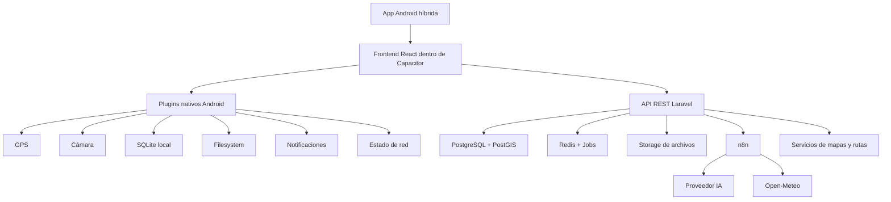

# Guaranda Go — Sistema híbrido Android para cicloturismo

Guaranda Go es un sistema móvil híbrido orientado a Android para fomentar, gestionar y acompañar recorridos de cicloturismo en la Provincia de Bolívar, Ecuador. La solución inicia enfocada en ciclistas locales y queda preparada para crecer posteriormente a todo Ecuador.

El sistema no se plantea como una PWA pura. La solución será una **app híbrida Android**, construida con una base web moderna y empaquetada como aplicación Android mediante **Capacitor**. Esto permite conservar la velocidad de desarrollo web, pero con acceso a capacidades nativas del dispositivo como GPS, cámara, almacenamiento local, notificaciones y seguimiento con pantalla bloqueada.

---

## 1. Objetivo del proyecto

Crear una aplicación móvil híbrida que permita a ciclistas registrados:

- Consultar rutas oficiales de ciclismo.
- Visualizar rutas sobre mapas interactivos.
- Descargar rutas para uso offline.
- Iniciar, pausar, reanudar, cancelar y finalizar recorridos.
- Registrar seguimiento GPS del recorrido.
- Ver métricas en tiempo real durante la ruta.
- Consultar puntos de interés vinculados a la ruta.
- Reportar incidencias con ubicación y fotografía.
- Guardar rutas favoritas.
- Valorar y comentar rutas completadas.
- Conversar con un asistente de IA para recibir recomendaciones basadas en rutas, POIs, clima, dificultad y edad del usuario.

Además, la aplicación contará con un módulo administrativo para gestionar rutas, usuarios, POIs, incidencias, comentarios, catálogos, estadísticas y configuración general.

---

## 2. Enfoque de alcance

La primera versión buscará incluir todas las funcionalidades principales definidas para el sistema. Sin embargo, el despliegue inicial será controlado y con baja carga operativa.

### Alcance territorial inicial

- Provincia de Bolívar, Ecuador.
- A futuro: expansión progresiva hacia otras provincias y eventualmente todo Ecuador.

### Usuarios iniciales estimados

- Aproximadamente 10 usuarios.
- Aproximadamente 3 usuarios usando GPS simultáneamente.
- Carga inicial: 1 ruta oficial y alrededor de 5 puntos de interés.

### Enfoque de producto

Aunque funcionalmente se desea una versión completa, se recomienda organizar el desarrollo por hitos técnicos internos:

1. Base del sistema, autenticación, rutas y administración.
2. Mapa, POIs y visualización de rutas.
3. Offline y almacenamiento local.
4. Seguimiento GPS y recorridos.
5. Incidencias, favoritos, valoraciones y comentarios.
6. Chatbot IA con n8n.
7. Estadísticas, auditoría y optimización.

Esto no significa dejar funcionalidades para una segunda fase, sino implementarlas de forma ordenada y verificable.

---

## 3. Tipo de aplicación

### Plataforma principal

- Android.
- Compatibilidad objetivo: Android 13 en adelante.
- Distribución inicial esperada: APK.
- Publicación futura en Google Play: opcional.

### Enfoque técnico

La aplicación será híbrida:

- Interfaz construida con React, Vite, TypeScript y Tailwind.
- Empaquetado Android mediante Capacitor.
- Acceso nativo a GPS, cámara, archivos, SQLite, notificaciones y estado de red.

### No se prioriza inicialmente

- iOS.
- Safari iOS.
- App nativa pura en Kotlin.
- Navegación por voz.
- Recalcular automáticamente la ruta si el usuario se desvía.
- Usuarios invitados.
- Login con Google, Facebook u otros proveedores.
- Videos en reportes de incidencias.

---

## 4. Stack tecnológico definido

| Capa | Tecnología definida |
|---|---|
| Backend | Laravel |
| Arquitectura backend | Monolito modular con API REST |
| Autenticación | Laravel Sanctum o equivalente basado en tokens |
| Roles y permisos | Roles simples: ciclista y administrador |
| Base de datos | PostgreSQL |
| Geodatos | PostGIS |
| Frontend móvil | React + Vite + TypeScript |
| Estilos | Tailwind CSS |
| Componentes UI | shadcn/ui |
| App Android híbrida | Capacitor Android |
| Mapas frontend | Leaflet inicialmente |
| Datos cartográficos | OpenStreetMap |
| Servidor de mapas | TileServer GL self-hosted y/o generación de mapa offline de Ecuador |
| Motores de rutas | OSRM, GraphHopper y OpenRouteService según necesidad |
| Offline local | SQLite local + almacenamiento de archivos en el dispositivo |
| IA | Integración externa con agente en n8n mediante webhook |
| Modelos IA | DeepSeek v4 Flash o GPT-5.5 configurados fuera del sistema, dentro del flujo de n8n |
| Clima | Open-Meteo integrado mediante n8n/backend |
| Colas | Laravel Jobs + Redis |
| Monitoreo | Registro de errores y actividad |
| Despliegue | Servidor/VPS para backend, base de datos, n8n, almacenamiento y servicios de mapas/rutas |

> Nota importante: aunque la app sea un APK instalado en Android, el sistema necesita servidor. En el servidor deben vivir la API, base de datos, almacenamiento de archivos, n8n, servicios de mapas/rutas y procesos de sincronización.

---

## 5. Arquitectura general



### Componentes del servidor

El servidor no solo almacena la base de datos. Debe proveer:

- API REST para la app Android.
- Autenticación y autorización.
- Gestión administrativa.
- Base de datos PostgreSQL/PostGIS.
- Almacenamiento de imágenes y archivos.
- Procesamiento de jobs/colas.
- n8n para chatbot IA y orquestaciones.
- Servicios propios o integraciones para mapas/rutas.
- Logs, auditoría y backups.

---

## 6. Roles del sistema

### 6.1 Ciclista

Usuario final de la aplicación. Debe iniciar sesión para usar cualquier función.

Puede:

- Ver rutas activas.
- Consultar detalle de rutas.
- Descargar rutas offline.
- Iniciar recorridos.
- Guardar favoritos.
- Reportar incidencias.
- Sugerir POIs.
- Reportar POIs incorrectos o cerrados.
- Calificar rutas completadas.
- Comentar rutas completadas.
- Usar el chatbot IA.
- Editar su perfil.
- Deshabilitar su cuenta mediante flujo controlado.

### 6.2 Administrador

Usuario responsable de administrar el contenido y operación del sistema.

Puede:

- Crear, editar, inhabilitar y publicar rutas.
- Gestionar POIs.
- Revisar sugerencias de POIs.
- Gestionar incidencias.
- Gestionar usuarios.
- Inhabilitar usuarios.
- Resetear contraseñas.
- Moderar comentarios y valoraciones.
- Consultar estadísticas.
- Exportar reportes.
- Configurar catálogos del sistema.
- Revisar auditoría de cambios.

### 6.3 Usuarios no autenticados

No existen usuarios invitados para esta versión.

Regla:

- Toda acción requiere inicio de sesión.
- Un usuario sin cuenta no puede ver rutas ni acceder a funcionalidades.

---

## 7. Autenticación y usuarios

### Registro e inicio de sesión

- Registro con correo y contraseña.
- Sin login social.
- No se requiere verificación de correo en la primera versión.
- Los usuarios iniciales/administradores pueden ser creados mediante seeders.
- El administrador podrá gestionar usuarios.

### Datos obligatorios del usuario

- Nombre.
- Apellido.
- Correo electrónico único.
- Contraseña con hash seguro.
- Género.
- Fecha de nacimiento.
- Rol.
- Estado activo/inactivo.

### Edad mínima

- 10 años.

### Uso de fecha de nacimiento

La fecha de nacimiento se utilizará para:

- Validar edad mínima.
- Permitir recomendaciones de IA según edad.
- Ajustar advertencias relacionadas con dificultad y seguridad.

### Cuenta de usuario

- El usuario puede editar su perfil.
- La cuenta no se elimina físicamente; se deshabilita.
- La eliminación lógica permite mantener trazabilidad y auditoría.

---

## 8. Flujo principal del ciclista

1. El usuario abre la app Android.
2. Inicia sesión.
3. Visualiza las rutas activas disponibles.
4. Selecciona una ruta.
5. Revisa detalle técnico, dificultad, POIs, recomendaciones, observaciones e incidencias activas.
6. Opcionalmente descarga la ruta para uso offline.
7. Inicia el recorrido.
8. La app registra ubicación GPS y muestra métricas en tiempo real.
9. Durante la ruta puede:
   - Ver su ubicación.
   - Ver avance sobre la ruta oficial.
   - Consultar POIs.
   - Reportar incidencias.
   - Consultar al asistente IA si tiene conexión.
10. Finaliza el recorrido.
11. Visualiza resumen.
12. Puede guardar, eliminar o exportar su recorrido.
13. Si completó aproximadamente el 90% de la ruta, puede valorar y comentar.

---

## 9. Gestión de rutas

### Creación de rutas

- Las rutas son creadas únicamente por administradores.
- Los ciclistas no pueden proponer rutas.
- Las rutas se crean desde el sistema mediante una herramienta interactiva de mapa.
- No se permitirá importar rutas desde GPX o GeoJSON en la primera versión.
- Todas las rutas oficiales deben ser creadas y gestionadas dentro del sistema.

### Trazado

- El administrador dibuja manualmente la ruta sobre el mapa.
- La ruta debe seguir caminos o vías reales cuando sea posible.
- Los motores de enrutamiento apoyan el cálculo de distancia, tiempos y recorridos hacia el inicio.
- Se permiten rutas circulares.
- La ruta puede tener puntos intermedios o puntos obligatorios de visita.

### Estados de ruta

- Borrador.
- Activa.
- Inactiva.

Reglas:

- Una ruta en borrador solo es visible para administradores.
- Una ruta activa es visible para ciclistas.
- Una ruta inactiva no aparece a ciclistas.
- Una ruta inactiva permanece visible en el panel administrador.
- No se elimina físicamente una ruta; se inhabilita.

### Versionado

- Cada ruta tiene un campo `version_ruta`.
- La versión aumenta cuando cambia información relevante para el usuario o para el modo offline.
- No se conservarán versiones históricas completas de rutas.
- Si una ruta descargada queda desactualizada, la app debe avisar al usuario que debe actualizarla.

### Datos obligatorios de una ruta

- Nombre.
- Descripción.
- Categoría.
- Dificultad.
- Estado.
- Punto de inicio.
- Punto final.
- Geometría.
- Imagen principal.
- Fotografías complementarias.
- Distancia.
- Tiempo estimado.
- Desnivel positivo.
- Desnivel negativo.
- Tipo de vía.
- Recomendaciones.
- Observaciones.
- POIs vinculados cuando aplique.

### Categorías de rutas

- Familiar.
- MTB.
- Urbana.
- Montaña.
- Turística.

### Dificultad

La dificultad se define manualmente por el administrador, considerando:

- Distancia.
- Desnivel positivo.
- Tipo de vía.
- Tiempo estimado.
- Experiencia requerida.

Niveles sugeridos:

- Fácil.
- Media.
- Difícil.

---

## 10. Mapa, geolocalización y navegación

### Visualización de mapa

- Se usará Leaflet para la visualización inicial.
- La cartografía se basará en OpenStreetMap.
- Se plantea un servidor propio de mapas con TileServer GL para reducir dependencia de terceros y soportar uso offline.

### Motores de enrutamiento

El sistema puede usar varios motores según el contexto:

- OSRM.
- GraphHopper.
- OpenRouteService.

Reglas:

- Se priorizarán alternativas open source o con capa gratuita viable.
- Si un servicio externo falla, el sistema debe degradarse parcialmente y no bloquear toda la app.
- La distancia desde la ubicación actual al inicio de la ruta se calculará siguiendo calles/caminos, no en línea recta.

### Navegación durante la ruta

- Navegación visual sobre mapa.
- Sin navegación por voz.
- Sin recálculo automático si el usuario se desvía.
- Se muestra ubicación en tiempo real.
- Se muestra orientación/brújula.
- Se busca precisión GPS alta.

### Pérdida de señal GPS o internet

Si el usuario pierde señal o conexión:

- La ruta descargada debe seguir disponible.
- El mapa base descargado debe seguir visible si fue descargado previamente.
- La app debe mostrar un indicador visual de señal débil/offline.
- El recorrido se guarda localmente.
- La sincronización se realiza cuando vuelva la conexión.
- El chatbot no funciona offline.

---

## 11. Modo offline

El modo offline es una funcionalidad central del sistema híbrido Android.

### Qué debe funcionar offline

Si el usuario descargó previamente una ruta, podrá:

- Ver la ruta.
- Ver el mapa base descargado.
- Navegar visualmente la ruta.
- Ver POIs descargados.
- Ver recomendaciones y observaciones.
- Ver imágenes descargadas.
- Registrar recorrido GPS.
- Guardar puntos GPS localmente.
- Reportar incidencias localmente.
- Adjuntar fotos a incidencias.
- Sincronizar datos cuando vuelva internet.

### Qué no funciona offline

- Chatbot IA.
- Consulta de clima actualizado.
- Nuevas rutas no descargadas.
- Actualizaciones en tiempo real de incidencias.
- Sincronización con servidor.

### Datos que se descargan con una ruta

- Geometría de la ruta.
- Nombre y descripción.
- Distancia.
- Desnivel.
- Tiempo estimado.
- Dificultad.
- Recomendaciones.
- Observaciones.
- POIs asociados o cercanos.
- Incidencias activas al momento de la descarga.
- Imágenes de ruta.
- Imágenes relevantes de POIs.
- Mapa base offline de Ecuador completo, según disponibilidad y capacidad de almacenamiento del dispositivo.

### Tamaño estimado de descarga

- Las rutas individuales con datos, POIs e imágenes pueden ocupar entre 100 MB y 300 MB, dependiendo del contenido.
- El mapa offline completo de Ecuador puede ocupar un tamaño considerablemente mayor, posiblemente en el orden de varios GB según formato, niveles de zoom y estrategia de empaquetado.
- La app debe validar almacenamiento disponible antes de descargar mapas o rutas.

### Reglas offline

- El usuario puede eliminar rutas descargadas.
- La app debe avisar si no hay almacenamiento suficiente.
- La app debe avisar si la ruta descargada está desactualizada.
- Las acciones offline se guardan en una cola local de sincronización.
- Cuando vuelve internet, se sincronizan incidencias, recorridos, puntos GPS y archivos pendientes.

---

## 12. Seguimiento GPS y recorridos

### Inicio de recorrido

- El usuario debe presionar “Iniciar recorrido”.
- Se solicita consentimiento para registrar ubicación.
- La app inicia seguimiento GPS.
- El recorrido queda asociado a una ruta.

### Estados del recorrido

- En curso.
- Pausado.
- Finalizado.
- Cancelado.

### Funciones del recorrido

- Iniciar.
- Pausar.
- Reanudar.
- Cancelar.
- Finalizar.
- Ver resumen final.
- Guardar recorrido.
- Eliminar recorrido.
- Exportar recorrido.

### Seguimiento con pantalla bloqueada

El sistema debe soportar seguimiento con pantalla bloqueada en Android mediante capacidades nativas de Capacitor/plugins Android.

Recomendación técnica:

- Usar un servicio en primer plano de Android para seguimiento GPS.
- Mostrar una notificación persistente mientras el recorrido está activo.
- Priorizar precisión sobre ahorro de batería.

### Frecuencia de registro GPS

- Registrar un punto GPS cada 60 segundos.
- La distancia recorrida se calculará principalmente como avance sobre la ruta oficial.
- Los puntos GPS se conservarán mientras el recorrido exista en el sistema.
- Para este proyecto universitario no se define una política avanzada de purga automática de puntos GPS.
- Si un recorrido se elimina desde la vista del usuario, se aplicará eliminación lógica cuando corresponda para mantener trazabilidad.

### Visibilidad administrativa de recorridos

- El administrador podrá ver métricas agregadas de recorridos.
- El administrador también podrá consultar recorridos completos con sus puntos GPS cuando sea necesario para revisión, soporte o análisis.

### Métricas durante el recorrido

- Distancia recorrida.
- Distancia restante.
- Tiempo transcurrido.
- Tiempo estimado restante.
- Velocidad actual.
- Velocidad promedio.
- Elevación.
- Desnivel acumulado.
- Porcentaje aproximado de avance.

### Recorrido válido

Un recorrido se considera válido/completado cuando el usuario haya recorrido aproximadamente el 90% de la ruta oficial.

Solo las rutas completadas podrán ser valoradas por el usuario.

---

## 13. Puntos de interés — POIs

### Categorías oficiales

- Comida.
- Tienda.
- Taller.
- Salud.
- Hospedaje.
- Mirador.

### Reglas de POIs

- Un POI pertenece a una sola categoría.
- Un POI no puede ser simultáneamente tienda y comida, por ejemplo.
- Los POIs oficiales son creados por administradores.
- Los ciclistas pueden sugerir nuevos POIs.
- Los ciclistas pueden reportar POIs cerrados o con información incorrecta.
- Los POIs pueden tener fotografías.
- Los POIs tienen horarios de atención.
- No se manejarán horarios especiales, feriados o cierres temporales en la primera versión.
- Se puede mostrar si un POI está abierto/cerrado según su horario registrado.

### Visibilidad de POIs

- El usuario verá principalmente los POIs vinculados a la ruta seleccionada.
- También se podrán cargar POIs cercanos dentro de un radio aproximado de 2 km cuando estén relacionados con la ruta o sean útiles para el recorrido.
- No se prioriza un catálogo global público de POIs fuera de rutas.

### Información de POIs

Según la categoría, se podrá mostrar:

- Nombre.
- Descripción.
- Observaciones.
- Dirección o referencia.
- Teléfono.
- Fotografías.
- Horarios.
- Servicios disponibles.
- Métodos de pago.
- Datos específicos de comida, tienda, taller, hospedaje o salud.

---

## 14. Incidencias y reportes

### Tipos de incidencia

- Derrumbe.
- Obstáculo.
- Vía cerrada.
- Inseguridad.
- Accidente.
- Daño en señalética.

### Reglas

- El usuario debe iniciar sesión para reportar una incidencia.
- Toda incidencia debe asociarse a una ruta.
- La incidencia puede ubicarse en cualquier punto del mapa, idealmente durante un recorrido o desde el detalle de una ruta.
- El usuario puede adjuntar fotografías.
- No se permiten videos.
- Tamaño máximo por archivo: 5 MB.
- Los administradores reciben notificación cuando se registra una nueva incidencia.
- Las incidencias recién reportadas no se muestran públicamente de inmediato.
- Una incidencia se muestra a los ciclistas solo después de revisión/validación administrativa.
- El usuario no recibirá necesariamente una respuesta directa cuando la incidencia sea revisada.

### Estados de incidencia

- Reportada.
- En revisión.
- Resuelta.
- Descartada.

### Visualización

- Los usuarios pueden ver incidencias activas validadas por administración sobre el mapa.
- La app debe alertar si una ruta tiene incidencias activas.
- Las incidencias resueltas o descartadas dejan de mostrarse como advertencias activas.

---

## 15. Favoritos, valoraciones y comentarios

### Favoritos

- Requiere inicio de sesión.
- El usuario puede guardar rutas favoritas aunque no las haya recorrido.

### Valoraciones

- El usuario solo puede valorar rutas completadas.
- Se permite una valoración por usuario por ruta.
- La calificación va de 1 a 5:
  - 1 = malo.
  - 5 = muy bueno.
- El usuario puede editar o eliminar su valoración.
- Las valoraciones rechazadas no cuentan en el promedio.
- Se muestra calificación promedio y número total de valoraciones aprobadas.

### Comentarios

- Los comentarios pasan por moderación.
- Estados de moderación:
  - Pendiente.
  - Aprobado.
  - Oculto.
  - Rechazado.
- No habrá filtro automático de palabras ofensivas en la primera versión.
- No se permitirá denunciar comentarios en la primera versión.
- El administrador podrá responder comentarios.

---

## 16. Chatbot IA

El chatbot funcionará únicamente online y no será un módulo nativo de IA dentro del sistema. Guaranda Go solo se integrará con un agente externo creado en n8n.

### Objetivos del chatbot

- Responder dudas generales sobre el sistema.
- Recomendar rutas.
- Advertir usando observaciones de rutas.
- Explicar POIs.
- Dar sugerencias según observaciones de POIs.
- Dar consejos de seguridad.
- Ayudar durante una ruta iniciada.
- Considerar edad del usuario.
- Considerar dificultad de la ruta.
- Consultar incidencias activas.
- Considerar clima mediante Open-Meteo.
- Mostrar imágenes relacionadas o generadas/configuradas mediante el flujo IA cuando aplique.

### Integración externa con n8n

- El agente de IA vive fuera del sistema, en n8n.
- n8n ya se encuentra implementado en el servidor mediante Dokploy.
- Guaranda Go consumirá un webhook externo de n8n.
- El sistema debe enviar la petición al webhook definido y mostrar/procesar el JSON devuelto por el nodo `Respond to Webhook`.
- La lógica de IA, prompts, herramientas, proveedor, límites y orquestación se gestionan aparte dentro de n8n.
- Las claves de IA no deben estar en la app Android ni en el frontend.

### Fuentes y responsabilidad de respuesta

La selección de fuentes, prompts, restricciones, proveedor IA y reglas anti-alucinación se gestionan en n8n. Desde Guaranda Go, la responsabilidad técnica es:

- Enviar al webhook los datos requeridos por el agente, si aplica.
- Recibir el JSON devuelto por n8n.
- Mostrar la respuesta en la interfaz del chatbot.
- Manejar errores, timeouts o respuestas inválidas del webhook.

El agente externo podrá usar, según su configuración en n8n:

- Datos de rutas registrados.
- POIs registrados.
- Observaciones y recomendaciones.
- Incidencias activas validadas.
- Datos del perfil relevantes, como edad.
- Datos climáticos desde Open-Meteo.

### Restricciones

- No funciona offline.
- No disponible para invitados.
- Límite aproximado: 30 a 50 mensajes por usuario, configurable.
- Debe evitar recomendaciones médicas, legales o de emergencia.
- La prevención de alucinaciones se gestionará desde el flujo y base de conocimiento configurados en n8n.

### Historial

- El usuario podrá ocultar/eliminar conversaciones de su vista.
- Por auditoría, las conversaciones no se borran físicamente; se usa eliminación lógica (`deleted_at`).
- Se recomienda separar conversaciones y mensajes en tablas distintas.

---

## 17. Panel administrador

El panel administrador será parte del sistema Laravel y deberá ser funcional bajo enfoque mobile first, aunque también puede usarse desde escritorio.

### Módulos administrativos

- Rutas.
- POIs.
- Incidencias.
- Usuarios.
- Comentarios.
- Valoraciones.
- Catálogos.
- Estadísticas.
- Configuración.
- Auditoría.

### Funciones administrativas

- Gestionar usuarios.
- Inhabilitar usuarios.
- Resetear contraseñas.
- Crear y editar rutas.
- Inhabilitar rutas.
- Publicar rutas.
- Gestionar POIs.
- Revisar sugerencias de POIs.
- Revisar reportes sobre POIs.
- Gestionar incidencias.
- Moderar comentarios.
- Responder comentarios.
- Exportar reportes.
- Consultar logs y auditoría.

### Permisos

- No se requieren múltiples niveles administrativos en la primera versión.
- Solo habrá rol administrador.
- Todas las acciones administrativas relevantes deben quedar auditadas.

---

## 18. Estadísticas y analítica

El administrador podrá consultar:

- Rutas más consultadas.
- Rutas más descargadas.
- Rutas mejor calificadas.
- Incidencias por estado.
- Usuarios activos.
- Recorridos completados.
- Reportes generados.

### Filtros

- Las estadísticas deben permitir filtros por fecha.

### Exportación

Se debe permitir exportar analíticas/reportes en formatos como:

- Excel.
- CSV.
- PDF.

---

## 19. Experiencia de usuario

### Enfoque visual

- Mobile first.
- No está pensada principalmente para escritorio.
- Debe funcionar correctamente en celulares Android de gama baja compatibles con Android 13+.

### Pantallas principales del ciclista

- Inicio.
- Login.
- Registro.
- Lista de rutas.
- Mapa.
- Detalle de ruta.
- Descargas offline.
- Navegación/recorrido.
- Favoritos.
- Perfil.
- Reportar incidencia.
- Chatbot IA.
- Historial/resumen de recorridos.

### Requisitos UX importantes

- Mensajes claros cuando no hay internet.
- Mensajes claros cuando no hay GPS.
- Solicitud explícita de permisos de ubicación.
- Indicador de modo offline.
- Indicador de señal GPS débil.
- Advertencias visibles para rutas con incidencias activas.
- Confirmaciones antes de eliminar datos locales.
- Diseño optimizado para uso en exteriores.

---

## 20. Rendimiento y escalabilidad inicial

### Requisitos iniciales

- Usuarios iniciales: aproximadamente 10.
- Usuarios GPS simultáneos: aproximadamente 3.
- Rutas iniciales: 1.
- POIs iniciales: alrededor de 5.
- Carga de mapa: máximo aproximado de 5 segundos.
- Longitud mínima de ruta válida: superior a 500 metros.

### Optimización

- Carga progresiva en listas.
- Cache de consultas frecuentes.
- Optimización automática de imágenes.
- Renderizado eficiente de mapas y marcadores.
- Manejo cuidadoso de batería durante seguimiento GPS.
- Sincronización diferida para datos offline.

---

## 21. Seguridad, privacidad y cumplimiento

### Seguridad básica

- Todas las comunicaciones deben usar HTTPS.
- Contraseñas con hash seguro.
- Autenticación con tokens.
- Control de acceso por rol.
- APIs administrativas protegidas.
- Rate limiting en endpoints sensibles.
- Validación estricta de archivos subidos.
- Límite de tamaño para imágenes de incidencias.
- No exponer claves de APIs en la app Android.

### Privacidad

El sistema almacenará datos personales como:

- Nombre.
- Apellido.
- Email.
- Fecha de nacimiento.
- Género.
- Ubicación GPS durante recorridos.
- Historial de recorridos.
- Incidencias reportadas.
- Conversaciones con IA.

Por buenas prácticas, debe incluir:

- Consentimiento explícito para registrar ubicación.
- Explicación clara del uso de ubicación.
- Política de privacidad.
- Términos y condiciones.
- Eliminación lógica o anonimización cuando corresponda.
- Cumplimiento con la normativa ecuatoriana de protección de datos personales.

### Auditoría

Deben registrarse acciones relevantes como:

- Creación/edición/inactivación de rutas.
- Cambios en usuarios.
- Cambios en POIs.
- Gestión de incidencias.
- Moderación de comentarios.
- Acciones administrativas críticas.

---

## 22. Despliegue e infraestructura

### Componentes mínimos de servidor

- Laravel API.
- PostgreSQL + PostGIS.
- Redis.
- n8n ya desplegado mediante Dokploy.
- Storage de archivos.
- Servicio de mapas para TileServer GL y/o generación del mapa offline de Ecuador.
- Servicio de enrutamiento si se instala OSRM/GraphHopper propio.
- Sistema de backups.
- Monitoreo/logs.

### Ambientes

Por limitaciones de tiempo se plantea despliegue directo a producción, pero se recomienda al menos:

- Ambiente local de desarrollo.
- Producción con backups.
- Datos de prueba controlados.

### CI/CD

- No se considera CI/CD inicialmente.

### Docker

- La app Android y Laravel no dependen directamente de Docker.
- n8n ya está implementado en el servidor mediante Dokploy.
- Servicios como TileServer GL, OSRM o GraphHopper pueden desplegarse mediante Dokploy/Docker si se decide instalarlos en el servidor.

---

## 23. Pruebas y criterios de aceptación

### Pruebas requeridas

- Pruebas funcionales.
- Pruebas de seguridad.
- Pruebas offline.
- Pruebas de GPS.
- Pruebas de rendimiento.
- Pruebas en ruta real.
- Pruebas en zonas con mala señal.
- Validación de precisión de distancia y desnivel.

### Dispositivos objetivo

- Android 13 o superior.
- Pruebas en dispositivos Android reales.
- Se debe probar especialmente con pantalla bloqueada y pérdida de conexión.

### Criterios de aceptación principales

#### Ruta creada correctamente

Una ruta se considera creada correctamente cuando:

- El administrador completa todos los campos obligatorios.
- La geometría se guarda correctamente.
- Tiene estado válido.
- Tiene imagen principal.
- Tiene métricas técnicas.
- Puede visualizarse en mapa.
- Si está activa, aparece al ciclista.

#### Descarga offline exitosa

Una descarga offline es exitosa cuando:

- La ruta se guarda localmente.
- La geometría se puede ver sin internet.
- Los POIs descargados aparecen sin internet.
- Las imágenes descargadas aparecen sin internet.
- El mapa base descargado aparece sin internet, si se habilitó descarga de mapa.
- La app registra la versión descargada.

#### Recorrido GPS válido

Un recorrido es válido cuando:

- Tiene ruta asociada.
- Tiene fecha de inicio y fin.
- Registra puntos GPS.
- Calcula distancia y tiempo.
- Recorre aproximadamente el 90% de la ruta oficial.

#### Incidencia reportada correctamente

Una incidencia se considera reportada correctamente cuando:

- Está asociada a una ruta.
- Tiene tipo, descripción y ubicación.
- Adjunta fotografía si el usuario la agregó.
- Si está offline, queda en cola local.
- Si está online, llega al servidor.
- El administrador recibe notificación.

---

# 24. Modelo de datos consolidado

La base de datos principal será PostgreSQL con PostGIS. Las tablas deben incluir, cuando aplique, campos estándar:

- `created_at`.
- `updated_at`.
- `deleted_at` para eliminación lógica.

Para datos geográficos se recomienda usar:

- Coordenadas WGS84 / SRID 4326.
- GeoJSON para consumo del frontend.
- Campos PostGIS `geometry` para consultas espaciales eficientes.
- Índices espaciales en rutas, POIs e incidencias.

---

## 24.1 Usuarios y seguridad

### `rol_usuario`

| Campo | Tipo sugerido | Descripción |
|---|---|---|
| id_rol | SERIAL PK | Identificador del rol |
| nombre_rol | VARCHAR UNIQUE | ciclista, administrador |

### `genero`

| Campo | Tipo sugerido | Descripción |
|---|---|---|
| id_genero | SERIAL PK | Identificador |
| nombre_genero | VARCHAR UNIQUE | masculino, femenino, otro, prefiero no decir |

### `usuario`

| Campo | Tipo sugerido | Descripción |
|---|---|---|
| id_usuario | SERIAL PK | Identificador |
| id_rol | INT FK | Rol del usuario |
| id_genero | INT FK | Género obligatorio |
| nombre_usuario | VARCHAR | Nombre |
| apellido_usuario | VARCHAR | Apellido |
| fecha_nacimiento | DATE | Obligatoria, mínimo 10 años |
| email | VARCHAR UNIQUE | Correo |
| clave_usuario | VARCHAR | Hash de contraseña |
| activo | BOOLEAN | Usuario habilitado/inhabilitado |
| created_at | TIMESTAMP | Creación |
| updated_at | TIMESTAMP | Actualización |
| deleted_at | TIMESTAMP NULL | Eliminación lógica |

### `usuario_consentimiento`

| Campo | Tipo sugerido | Descripción |
|---|---|---|
| id_consentimiento | SERIAL PK | Identificador |
| id_usuario | INT FK | Usuario |
| tipo_consentimiento | VARCHAR | ubicación, términos, privacidad |
| aceptado | BOOLEAN | Estado |
| fecha_aceptacion | TIMESTAMP | Fecha de aceptación |
| version_documento | VARCHAR | Versión aceptada |

### `auditoria_admin`

| Campo | Tipo sugerido | Descripción |
|---|---|---|
| id_auditoria | BIGSERIAL PK | Identificador |
| id_usuario_admin | INT FK | Administrador que ejecutó la acción |
| modulo | VARCHAR | rutas, POIs, usuarios, incidencias, etc. |
| accion | VARCHAR | crear, editar, inhabilitar, aprobar, rechazar |
| entidad | VARCHAR | Nombre de entidad afectada |
| entidad_id | INT | ID afectado |
| datos_anteriores | JSONB | Estado previo |
| datos_nuevos | JSONB | Estado nuevo |
| fecha_accion | TIMESTAMP | Fecha |

---

## 24.2 Rutas

### `dificultad_ruta`

| Campo | Tipo sugerido | Descripción |
|---|---|---|
| id_dificultad | SERIAL PK | Identificador |
| nombre_dificultad | VARCHAR UNIQUE | fácil, media, difícil |
| descripcion | TEXT | Descripción |

### `estado_ruta`

| Campo | Tipo sugerido | Descripción |
|---|---|---|
| id_estado_ruta | SERIAL PK | Identificador |
| nombre_estado | VARCHAR UNIQUE | borrador, activa, inactiva |
| descripcion_estado | TEXT | Descripción/motivo |

### `categoria_ruta`

| Campo | Tipo sugerido | Descripción |
|---|---|---|
| id_categoria_ruta | SERIAL PK | Identificador |
| nombre_categoria | VARCHAR UNIQUE | familiar, MTB, urbana, montaña, turística |
| descripcion | TEXT | Descripción |

### `ruta`

| Campo | Tipo sugerido | Descripción |
|---|---|---|
| id_ruta | SERIAL PK | Identificador |
| id_administrador | INT FK | Administrador creador |
| id_dificultad | INT FK | Dificultad |
| id_estado_ruta | INT FK | Estado |
| id_categoria_ruta | INT FK | Categoría |
| nombre_ruta | VARCHAR | Nombre |
| descripcion_ruta | TEXT | Descripción |
| nombre_inicio_ruta | VARCHAR | Punto inicial |
| latitud_inicio | DECIMAL | Latitud inicial |
| longitud_inicio | DECIMAL | Longitud inicial |
| nombre_final_ruta | VARCHAR | Punto final |
| latitud_final | DECIMAL | Latitud final |
| longitud_final | DECIMAL | Longitud final |
| tipo_via | VARCHAR | Referencia del tipo de vía |
| experiencia_requerida | TEXT | Referencia para dificultad |
| imagen_principal_url | VARCHAR | Imagen principal |
| version_ruta | INT | Versión vigente |
| fecha_creacion | TIMESTAMP | Fecha de creación |
| fecha_actualizacion | TIMESTAMP | Última actualización |
| created_at | TIMESTAMP | Creación |
| updated_at | TIMESTAMP | Actualización |
| deleted_at | TIMESTAMP NULL | Inhabilitación lógica |

### `ruta_imagen`

| Campo | Tipo sugerido | Descripción |
|---|---|---|
| id_ruta_imagen | SERIAL PK | Identificador |
| id_ruta | INT FK | Ruta |
| url_imagen | VARCHAR | Imagen |
| descripcion | TEXT | Texto alternativo/descripción |
| es_principal | BOOLEAN | Marca imagen principal |
| orden | INT | Orden |

### `ruta_geometria`

| Campo | Tipo sugerido | Descripción |
|---|---|---|
| id_ruta | INT PK/FK | Ruta |
| geojson | JSONB | Geometría para frontend |
| geom | GEOMETRY(LineString,4326) | Geometría PostGIS recomendada |

### `motor_enrutamiento`

| Campo | Tipo sugerido | Descripción |
|---|---|---|
| id_motor_enrutamiento | SERIAL PK | Identificador |
| nombre_motor | VARCHAR UNIQUE | OSRM, GraphHopper, OpenRouteService |
| activo | BOOLEAN | Disponible o no |

### `medio_transporte`

| Campo | Tipo sugerido | Descripción |
|---|---|---|
| id_medio_transporte | SERIAL PK | Identificador |
| nombre_medio | VARCHAR UNIQUE | bicicleta, caminata |

### `ruta_metrica`

| Campo | Tipo sugerido | Descripción |
|---|---|---|
| id_ruta_metrica | SERIAL PK | Identificador |
| id_ruta | INT FK | Ruta |
| version_ruta | INT | Versión de ruta calculada |
| id_medio_transporte | INT FK | Medio |
| id_motor_enrutamiento | INT FK | Motor usado |
| distancia_km | DECIMAL | Distancia total |
| tiempo_estimado_min | INT | Tiempo estimado |
| desnivel_positivo_m | DECIMAL | Subida acumulada |
| desnivel_negativo_m | DECIMAL | Bajada acumulada |
| fecha_calculo | TIMESTAMP | Fecha cálculo |

### `ruta_recomendacion`

| Campo | Tipo sugerido | Descripción |
|---|---|---|
| id_ruta_recomendacion | SERIAL PK | Identificador |
| id_ruta | INT FK | Ruta |
| texto_recomendacion | TEXT | Recomendación |

### `ruta_observacion`

| Campo | Tipo sugerido | Descripción |
|---|---|---|
| id_ruta_observacion | SERIAL PK | Identificador |
| id_ruta | INT FK | Ruta |
| texto_observacion | TEXT | Observación |

---

## 24.3 Puntos de interés

### `categoria_poi`

| Campo | Tipo sugerido | Descripción |
|---|---|---|
| id_categoria_poi | SERIAL PK | Identificador |
| nombre_categoria | VARCHAR UNIQUE | comida, tienda, taller, salud, hospedaje, mirador |
| descripcion | TEXT | Descripción |

### `punto_interes`

| Campo | Tipo sugerido | Descripción |
|---|---|---|
| id_punto_interes | SERIAL PK | Identificador |
| id_categoria_poi | INT FK | Categoría única |
| nombre_punto_interes | VARCHAR | Nombre |
| descripcion_punto_interes | TEXT | Descripción |
| observaciones | TEXT | Observaciones |
| latitud | DECIMAL | Latitud |
| longitud | DECIMAL | Longitud |
| geom | GEOMETRY(Point,4326) | Punto PostGIS recomendado |
| direccion | TEXT | Dirección o referencia |
| telefono | VARCHAR | Teléfono |
| activo | BOOLEAN | Estado |
| created_at | TIMESTAMP | Creación |
| updated_at | TIMESTAMP | Actualización |
| deleted_at | TIMESTAMP NULL | Inhabilitación lógica |

### `ruta_punto_interes`

| Campo | Tipo sugerido | Descripción |
|---|---|---|
| id_ruta | INT PK/FK | Ruta |
| id_punto_interes | INT PK/FK | POI |
| orden_en_ruta | INT | Orden sugerido |
| es_obligatorio | BOOLEAN | Punto que se debe visitar |
| distancia_desde_inicio_km | DECIMAL | Distancia desde inicio |
| observacion_en_ruta | TEXT | Observación específica |

### `horario_punto_interes`

| Campo | Tipo sugerido | Descripción |
|---|---|---|
| id_horario | SERIAL PK | Identificador |
| id_punto_interes | INT FK | POI |
| dia_semana | SMALLINT | Día 1 a 7 |
| hora_apertura | TIME | Apertura |
| hora_cierre | TIME | Cierre |
| descripcion_horario | VARCHAR | Texto opcional |

### `punto_interes_imagen`

| Campo | Tipo sugerido | Descripción |
|---|---|---|
| id_poi_imagen | SERIAL PK | Identificador |
| id_punto_interes | INT FK | POI |
| url_imagen | VARCHAR | Imagen |
| descripcion | TEXT | Descripción |
| orden | INT | Orden |

### `punto_interes_sugerencia`

| Campo | Tipo sugerido | Descripción |
|---|---|---|
| id_sugerencia | SERIAL PK | Identificador |
| id_usuario | INT FK | Ciclista que sugiere |
| id_categoria_poi | INT FK | Categoría sugerida |
| nombre | VARCHAR | Nombre sugerido |
| descripcion | TEXT | Descripción |
| latitud | DECIMAL | Latitud |
| longitud | DECIMAL | Longitud |
| estado | VARCHAR | pendiente, aprobada, rechazada |
| fecha_sugerencia | TIMESTAMP | Fecha |

### `punto_interes_reporte`

| Campo | Tipo sugerido | Descripción |
|---|---|---|
| id_reporte_poi | SERIAL PK | Identificador |
| id_usuario | INT FK | Usuario reporta |
| id_punto_interes | INT FK | POI reportado |
| tipo_reporte | VARCHAR | cerrado, datos incorrectos, otro |
| descripcion | TEXT | Detalle |
| estado | VARCHAR | pendiente, revisado, descartado |
| fecha_reporte | TIMESTAMP | Fecha |

---

## 24.4 Detalles específicos de POIs

Se mantienen tablas especializadas para información particular por categoría.

### Catálogos

- `rango_precio`: económico, moderado, alto.
- `tipo_cocina`: típica, fast food, vegetariana, café, etc.
- `tipo_hospedaje`: hostal, camping, refugio, hotel.
- `tipo_tienda`: tienda de barrio, minimarket, despensa rural.
- `especialidad_taller`: bicicletas, motos, etc.
- `servicio_taller`: parche, frenos, cadena, etc.
- `tipo_centro_salud`: puesto de salud, hospital básico, farmacia.

### Tablas de detalle

- `detalle_comida`.
- `detalle_hospedaje`.
- `detalle_tienda`.
- `detalle_taller`.
- `detalle_taller_servicio`.
- `detalle_salud`.

Estas tablas deben mantener una relación 1 a 1 o 1 a N según corresponda con `punto_interes`.

---

## 24.5 Favoritos, valoraciones y comentarios

### `usuario_ruta_favorita`

| Campo | Tipo sugerido | Descripción |
|---|---|---|
| id_usuario | INT PK/FK | Usuario |
| id_ruta | INT PK/FK | Ruta |
| fecha_favorito | TIMESTAMP | Fecha |

### `estado_moderacion`

| Campo | Tipo sugerido | Descripción |
|---|---|---|
| id_estado_moderacion | SERIAL PK | Identificador |
| nombre_estado | VARCHAR UNIQUE | pendiente, aprobado, oculto, rechazado |

### `valoracion_ruta`

| Campo | Tipo sugerido | Descripción |
|---|---|---|
| id_valoracion | SERIAL PK | Identificador |
| id_usuario | INT FK | Usuario |
| id_ruta | INT FK | Ruta |
| id_recorrido | INT FK NULL | Recorrido completado que habilita valoración |
| id_estado_moderacion | INT FK | Estado moderación |
| calificacion | SMALLINT | 1 a 5 |
| comentario | TEXT | Comentario |
| respuesta_admin | TEXT | Respuesta del administrador |
| fecha_valoracion | TIMESTAMP | Fecha |
| fecha_actualizacion | TIMESTAMP | Actualización |
| deleted_at | TIMESTAMP NULL | Eliminación lógica |

Regla única recomendada:

- `UNIQUE(id_usuario, id_ruta)`.

---

## 24.6 Incidencias

### `tipo_incidencia`

| Campo | Tipo sugerido | Descripción |
|---|---|---|
| id_tipo_incidencia | SERIAL PK | Identificador |
| nombre_tipo_incidencia | VARCHAR UNIQUE | derrumbe, obstáculo, vía cerrada, inseguridad, accidente, daño en señalética |

### `estado_incidencia`

| Campo | Tipo sugerido | Descripción |
|---|---|---|
| id_estado_incidencia | SERIAL PK | Identificador |
| nombre_estado | VARCHAR UNIQUE | reportada, en revisión, resuelta, descartada |

### `incidencia`

| Campo | Tipo sugerido | Descripción |
|---|---|---|
| id_incidencia | SERIAL PK | Identificador |
| id_usuario | INT FK | Usuario reporta |
| id_ruta | INT FK | Ruta asociada |
| id_tipo_incidencia | INT FK | Tipo |
| id_estado_incidencia | INT FK | Estado |
| titulo | VARCHAR | Título |
| descripcion | TEXT | Descripción |
| latitud | DECIMAL | Latitud |
| longitud | DECIMAL | Longitud |
| geom | GEOMETRY(Point,4326) | Punto PostGIS recomendado |
| fecha_reporte | TIMESTAMP | Fecha reporte |
| fecha_actualizacion | TIMESTAMP | Actualización |
| fecha_resolucion | TIMESTAMP NULL | Resolución |
| respuesta_admin | TEXT | Respuesta interna/admin |

### `incidencia_archivo`

| Campo | Tipo sugerido | Descripción |
|---|---|---|
| id_incidencia_archivo | SERIAL PK | Identificador |
| id_incidencia | INT FK | Incidencia |
| url_archivo | VARCHAR | Imagen |
| tipo_archivo | VARCHAR | imagen |
| tamano_bytes | INT | Máximo 5 MB |
| fecha_subida | TIMESTAMP | Fecha |

---

## 24.7 Seguimiento GPS y recorridos

### `estado_recorrido`

| Campo | Tipo sugerido | Descripción |
|---|---|---|
| id_estado_recorrido | SERIAL PK | Identificador |
| nombre_estado | VARCHAR UNIQUE | en curso, pausado, finalizado, cancelado |

### `recorrido`

| Campo | Tipo sugerido | Descripción |
|---|---|---|
| id_recorrido | SERIAL PK | Identificador |
| id_usuario | INT FK | Usuario |
| id_ruta | INT FK | Ruta |
| id_estado_recorrido | INT FK | Estado |
| fecha_inicio | TIMESTAMP | Inicio |
| fecha_fin | TIMESTAMP NULL | Fin |
| distancia_recorrida_km | DECIMAL | Distancia |
| tiempo_total_seg | INT | Tiempo |
| porcentaje_completado | DECIMAL | Avance sobre ruta oficial |
| es_valido | BOOLEAN | True si completa aprox. 90% |
| resumen_json | JSONB | Métricas finales |
| created_at | TIMESTAMP | Creación |
| updated_at | TIMESTAMP | Actualización |
| deleted_at | TIMESTAMP NULL | Eliminación lógica |

### `recorrido_punto_gps`

| Campo | Tipo sugerido | Descripción |
|---|---|---|
| id_recorrido_punto_gps | BIGSERIAL PK | Identificador |
| id_recorrido | INT FK | Recorrido |
| latitud | DECIMAL | Latitud |
| longitud | DECIMAL | Longitud |
| geom | GEOMETRY(Point,4326) | Punto PostGIS recomendado |
| elevacion_m | DECIMAL | Elevación |
| velocidad_kmh | DECIMAL | Velocidad |
| precision_m | DECIMAL | Precisión GPS |
| fecha_hora | TIMESTAMP | Momento del registro |

---

## 24.8 Offline, descargas y sincronización

### `formato_exportacion`

| Campo | Tipo sugerido | Descripción |
|---|---|---|
| id_formato_exportacion | SERIAL PK | Identificador |
| nombre_formato | VARCHAR UNIQUE | GPX, GeoJSON |

### `ruta_descarga`

| Campo | Tipo sugerido | Descripción |
|---|---|---|
| id_ruta_descarga | SERIAL PK | Identificador |
| id_usuario | INT FK | Usuario |
| id_ruta | INT FK | Ruta descargada |
| id_formato_exportacion | INT FK NULL | Formato si aplica |
| version_ruta | INT | Versión descargada |
| estado_descarga | VARCHAR | iniciada, exitosa, fallida, eliminada |
| tamano_mb | DECIMAL | Tamaño aproximado |
| fecha_descarga | TIMESTAMP | Fecha descarga |
| fecha_eliminacion_local | TIMESTAMP NULL | Eliminación local |

### `ruta_consulta`

| Campo | Tipo sugerido | Descripción |
|---|---|---|
| id_ruta_consulta | BIGSERIAL PK | Identificador |
| id_usuario | INT FK | Usuario |
| id_ruta | INT FK | Ruta consultada |
| fecha_consulta | TIMESTAMP | Fecha |

### `cola_sincronizacion`

| Campo | Tipo sugerido | Descripción |
|---|---|---|
| id_sincronizacion | BIGSERIAL PK | Identificador |
| id_usuario | INT FK | Usuario |
| tipo_evento | VARCHAR | incidencia, recorrido, archivo, favorito, valoración |
| payload | JSONB | Datos pendientes |
| estado | VARCHAR | pendiente, enviado, error |
| intentos | INT | Reintentos |
| ultimo_error | TEXT | Error |
| fecha_creacion | TIMESTAMP | Fecha creación |
| fecha_sincronizacion | TIMESTAMP NULL | Fecha enviado |

> Esta tabla puede existir en servidor para auditoría, pero la cola principal offline debe existir también localmente en SQLite dentro de la app Android.

---

## 24.9 Chatbot IA

### `conversacion_ia`

| Campo | Tipo sugerido | Descripción |
|---|---|---|
| id_conversacion_ia | SERIAL PK | Identificador |
| id_usuario | INT FK | Usuario |
| titulo | VARCHAR | Título/resumen |
| contexto_json | JSONB | Contexto usado: ruta, POIs, clima, edad, etc. |
| fecha_inicio | TIMESTAMP | Inicio |
| fecha_actualizacion | TIMESTAMP | Última actividad |
| deleted_at | TIMESTAMP NULL | Oculta para usuario, conserva auditoría |

### `mensaje_ia`

| Campo | Tipo sugerido | Descripción |
|---|---|---|
| id_mensaje_ia | BIGSERIAL PK | Identificador |
| id_conversacion_ia | INT FK | Conversación |
| rol | VARCHAR | usuario, asistente, sistema |
| mensaje | TEXT | Contenido |
| proveedor_ia | VARCHAR | DeepSeek, GPT, etc. |
| metadata | JSONB | Tokens, modelo, fuentes internas, errores |
| fecha_mensaje | TIMESTAMP | Fecha |

---

## 24.10 Notificaciones

### `notificacion`

| Campo | Tipo sugerido | Descripción |
|---|---|---|
| id_notificacion | BIGSERIAL PK | Identificador |
| id_usuario | INT FK | Usuario destinatario |
| tipo | VARCHAR | incidencia, sistema, descarga, recorrido |
| titulo | VARCHAR | Título |
| mensaje | TEXT | Mensaje |
| leida | BOOLEAN | Estado |
| fecha_creacion | TIMESTAMP | Fecha |

---

# 25. Base local en Android

La app Android debe manejar una base local SQLite para funcionamiento offline.

Datos locales mínimos:

- Usuario autenticado y token seguro.
- Rutas descargadas.
- Geometrías GeoJSON.
- POIs descargados.
- Imágenes descargadas o referencias locales.
- Incidencias activas descargadas.
- Recorridos en curso.
- Puntos GPS pendientes de sincronizar.
- Incidencias creadas offline.
- Fotos pendientes de subir.
- Cola de sincronización.
- Configuración offline.

---

# 26. Decisiones técnicas importantes

## 26.1 Almacenamiento de archivos

No se recomienda guardar imágenes directamente en la base de datos. Se recomienda:

- Guardar archivos en disco local del servidor para primera versión.
- Guardar en la base de datos solo la ruta/URL y metadatos.
- Migrar a S3 compatible si el sistema crece.

## 26.2 Mapas offline

Descargar una ruta offline no es lo mismo que descargar un mapa completo.

El sistema debe diferenciar:

- Ruta offline: geometría, datos, POIs, imágenes.
- Mapa offline: tiles o datos cartográficos descargados.

Para la primera implementación Android, el objetivo es soportar ambas cosas si el almacenamiento y el servidor de mapas lo permiten, pero debe cuidarse el tamaño de descarga.

## 26.3 Servicios externos

Aunque se busca una solución open source y self-hosted, algunos servicios como IA, Open-Meteo o APIs de rutas pueden depender de internet.

La app debe funcionar parcialmente aunque estos servicios fallen.

## 26.4 n8n y claves de IA

Las claves de IA deben estar en el servidor/n8n, nunca dentro del APK.

---

# 27. Funcionalidades excluidas explícitamente en esta versión

Aunque el sistema será amplio, no se consideran parte de esta versión:

- Usuarios invitados.
- Login con Google/Facebook.
- Navegación por voz.
- Recalcular ruta automáticamente si el usuario se desvía.
- Videos en incidencias.
- Importación de rutas GPX/GeoJSON por administrador.
- Creación pública de rutas por ciclistas.
- Red social entre ciclistas.
- Chat entre usuarios.
- Pagos, reservas o compras.
- Denuncias de comentarios.
- Filtro automático de lenguaje ofensivo.
- Funcionamiento offline del chatbot.
- Soporte prioritario para iOS.

---

# 28. Decisiones finales aclaradas

Las siguientes decisiones reemplazan los puntos pendientes anteriores:

1. Las incidencias no se muestran públicamente apenas se reportan. Primero deben pasar por revisión/validación administrativa.
2. n8n ya está implementado en el servidor mediante Dokploy. El sistema consumirá el agente externo de n8n por webhook. Para otros servicios como TileServer GL, OSRM o GraphHopper, se podrá usar Dokploy/Docker si se decide instalarlos.
3. La distribución inicial será por APK. No se prioriza Google Play Store en esta versión.
4. El sistema no tendrá un módulo nativo de IA. Solo se conectará a un webhook externo de n8n y mostrará/procesará el JSON devuelto por el nodo `Respond to Webhook`. Los modelos como DeepSeek v4 Flash o GPT-5.5 se configurarán aparte dentro de n8n.
5. La firma y actualización del APK serán básicas, acordes a un proyecto universitario. No se requiere un flujo avanzado de publicación o actualización automática.
6. Los puntos GPS se conservarán mientras exista el recorrido. No se define una política avanzada de purga automática para esta versión.
7. El administrador podrá ver tanto métricas agregadas como recorridos completos con puntos GPS.
8. Se buscará implementar mapa offline completo de Ecuador, además de rutas, POIs, imágenes y datos descargables. Esto requiere controlar tamaño de descarga y almacenamiento disponible.
9. La aprobación legal/institucional de términos, privacidad y uso de datos corresponderá a la Universidad Estatal de Bolívar.

---

# 29. Resumen final

Guaranda Go será una app híbrida Android para ciclistas de la Provincia de Bolívar. Requiere login obligatorio y ofrece rutas oficiales, mapas, navegación visual, descarga offline, seguimiento GPS, incidencias, POIs, favoritos, valoraciones, comentarios moderados, estadísticas administrativas y chatbot IA.

El stack definido es:

```txt
Backend: Laravel
Arquitectura: Monolito modular + API REST
Base de datos: PostgreSQL + PostGIS
Frontend: React + Vite + TypeScript
UI: Tailwind CSS + shadcn/ui
App móvil: Capacitor Android
Offline: SQLite local + Filesystem
Mapas: Leaflet + OpenStreetMap / TileServer GL + mapa offline de Ecuador
Rutas: OSRM / GraphHopper / OpenRouteService
IA: webhook externo n8n; la app muestra JSON del agente
Clima: Open-Meteo
Colas: Laravel Jobs + Redis
Servidor: VPS o servidor institucional
```

La prioridad técnica es que la app funcione bien en Android, especialmente en uso real de campo: rutas descargadas, GPS, pantalla bloqueada, mala conexión, sincronización posterior y experiencia mobile first.
